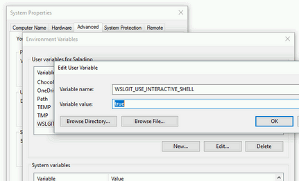

# WSLGit

[](https://travis-ci.org/hangxingliu/wslgit)

This project is a fork of https://github.com/hangxingliu/wslgit 
The purpose is to enable `wslgit` in Smartgit, the git client myself use a lot.

This basically dded a dirty quick fix to allow Smartgit to do push/pull with git in WSL.

For it to work properly, you need,
*  The repo need to setup correctly and credential saved.
*  do `git config credential.helper store` in WSL
*  then do a push/pull manually in WSL, type in credentials to have credential saved.

Now when you push/pull in smartgit in Windows, it uses credential stored in WSL. So you need to do this for each remote. I know it is dirty, but I don't want to spend more time on it....

## Usage

1. Please ensure `git` is installed in your WSL.
2. Copy `wslgit.sh` to the `/usr/bin/` or `~/bin` directory in your WSL.
3. Add the following config into your VSCode Settings.
    - `{ "git.path": "C:\\path\\to\\git.bat" }`

### 🐢 Feeling slowly? (Disable interactive shell)

wslgit launch git installed in WSL in interactive shell mode by default now.   
In short, the `ssh-agent` setup in `.bashrc` script is supported. but slower then non-interactive mode.

If you want disable interactive shell to reduce launch time, you can set Windows environment variable `WSLGIT_USE_INTERACTIVE_SHELL` to `false`.

#### via GUI



#### via Powershell

``` powershell
[System.Environment]::SetEnvironmentVariable("WSLGIT_USE_INTERACTIVE_SHELL", "false", "User")
```


### For under the hood detail, checkout original repo https://github.com/hangxingliu/wslgit
